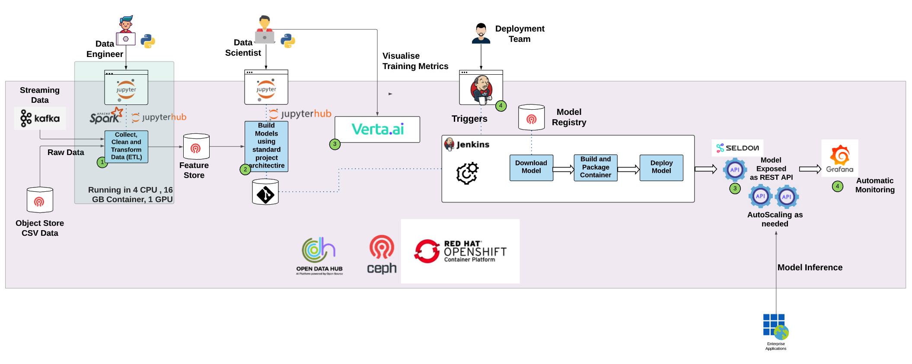

# AI/ML on Kubernetes - end to end workflow

## Introduction
This describes an end to end AI/ML workflow and lifcycle. The use case is predicting customer churn - though the capabilities and tools are transferrable to any AI/ML use case.

This diagram depicts the flow and actors involved at each stage:

## Workshop Setup
You or your workshop facilitator should have completed the setup as described in the [Setup Instructions](setup-v2.md) 

## Instructions
Your facilitator will have assigned you credentials that you can use throughout today's workshop. Specifically 
- a username, something like _*user29*_
- a password which will be _openshift_ unless your facilitator advises you otherwise.

Today's workshop will be split up into sub-modules - logically following the workflow in the diagram above.. 
- [Data Engineer prepares data](workshop-1-data-engineer.md)
- [Data Scientist visualises and analyses prepared data, experiments and trains model.](workshop-2-3-4-data-science.md)
- [OpenShift's ML/OPs deploys the model to production](workshop-5-deployment.md)

## Next Steps

Let's get started. Move to [Data Engineer prepares data](workshop-1-data-engineer.md)

